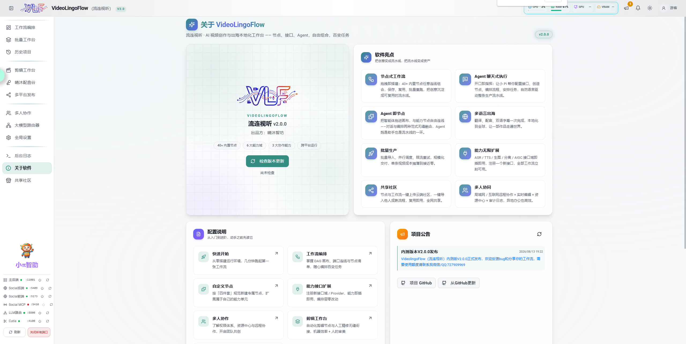
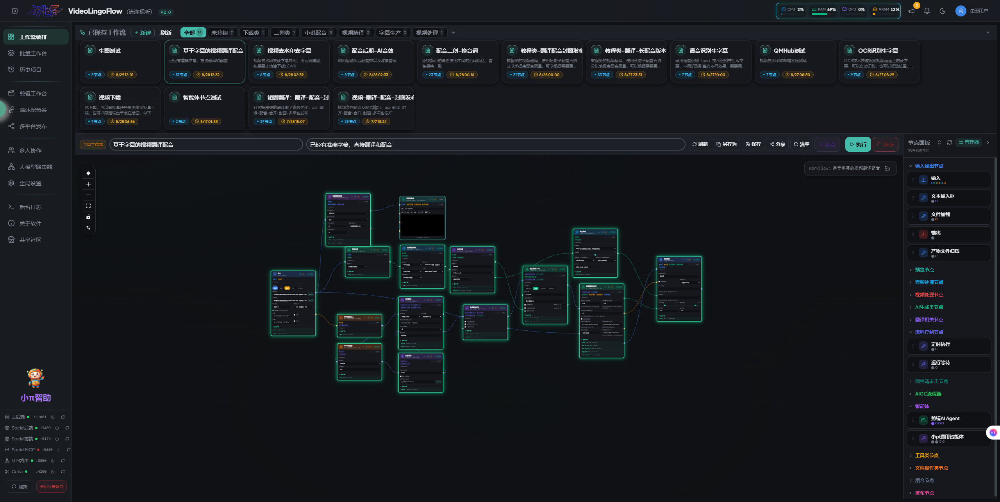
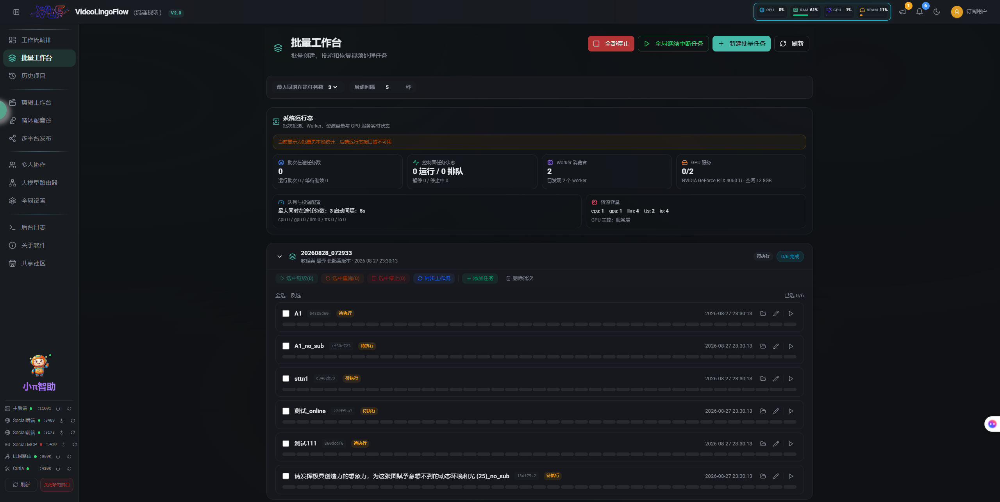
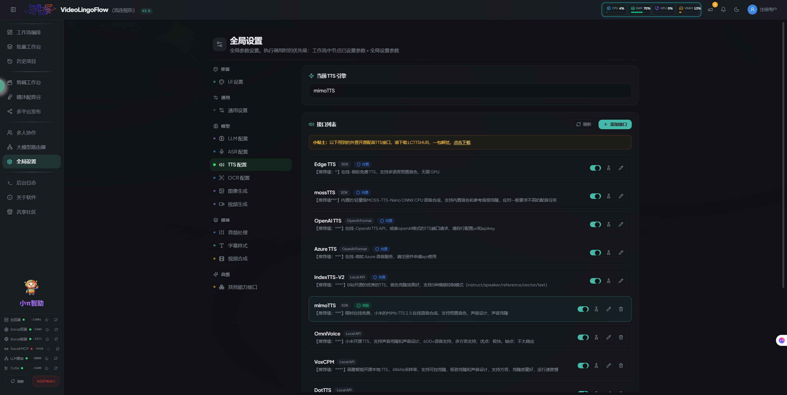

# VideoLingoFlow

> 🌐 语言 / Language：**简体中文** · [English](README.en.md)

一套面向**本地优先、可无限扩展、可多人协作**的 AI 自动化创作框架。它把「视频字幕、翻译、配音、剪辑、AI 编辑、批量生产、多平台发布」沉淀为**节点工作流 + Agent 聊天式执行 + 能力接口自由扩展**三大骨架——无论是个人创作者、团队工作室还是异地协作团队，都能用同一套框架随心所欲地编排任务。

> **一句话定位**：一切任务 = 可视化节点编排；一切能力 = 可插拔接口；一切指令 = 对话即执行。节点、接口、Agent 三者自由组合，百变任务，随心所欲。

---

## 为什么需要这套框架

传统自动化工具往往「功能写死、扩展靠改代码、协作靠手动传文件」。VideoLingoFlow 从设计上解决三件事：

- **标准化任务模型**：所有任务都是一张有向无环图（DAG）。每个节点是一个可复用的能力单元，节点间通过语义化端口连线传递数据。任务 = 图，图 = 可保存、可复用、可批量重跑、可分享。
- **能力与编排解耦**：能力接口（ASR / TTS / 生图 / 人声分离 / AIGC / 发布…）与业务编排完全分离。新增一种能力，只需要注册一个接口，**编排层零改动**；反过来，调整一条生产链路，也只需要拖拽连线，能力层零改动。
- **人人可扩展**：框架提供三件套扩展手段——**自定义节点**、**新增能力接口**、**把 Agent 当作节点**。扩展不需要修改框架内核，插件式挂载即可。

> 这使它不只是一个「视频工具」，而是一个可以承载任何 AI 工作流的**创作操作系统**。

下面是工作台的部分界面预览：



---

## 核心能力

### 1. 节点式工作流，节点可自定义

基于 `@xyflow/react` 的可视化 DAG 编排画布，内置 **40+ 节点**覆盖输入、平台下载、音频、ASR、翻译、字幕、配音、合成、生图、发布全链路。支持：

- **自定义节点**：按「节点定义 + 执行步骤 + 规则校验 + 注册」四件套即可新增节点，字段级规则校验、端口语义连线、节点产物落盘规范全部内置约定。
- 工作流可保存、复用、批量重跑；节点级产物管理与清理由控制平面自动完成。



### 2. 能力接口，随意自定义增加

能力层按「接口域」组织：ASR / TTS / 生图 / 人声分离 / AIGC / 发布等。每类接口支持**多 Provider 自由切换**（如 ASR 可选 WhisperX、FunASR、Qwen3-ASR、ElevenLabs…）。新增一个能力接口 = 定义数据模型 + 实现调用 + 注册接口域，**无需改动任何编排逻辑**。示例：想要接入新的 TTS 服务商，注册一个 TTS 接口，全部工作流立刻可用。

### 3. Agent 聊天式执行任务

内嵌项目专用 AI 助手「小 Pi」，用**自然语言对话**指挥整条流水线：

- **配置接口**：对话中完成能力接口的配置与切换；
- **创造节点**：描述需求，Agent 自动生成自定义节点的定义与步骤；
- **安排任务**：口头下达任务，Agent 解析为工作流并调度执行；
- **排障与整理**：流式对话排查问题、整理文件、准备发布。

小 Pi 支持六种角色（通用 / 节点创建 / 工作流编排 / 任务执行 / 文件整理 / 作品发布），会话历史留存，支持工具调用。

### 4. Agent 即节点，随意编排

框架把 Agent 实现为**内置节点类型**（`pi_agent` 通用智能体节点、`editor_agent` 剪辑智能体节点）。你可以把 Agent 直接拖进画布，与普通能力节点混合连线——**Agent 既是对话助手，也是流水线上的一个节点**，前一步的产物可以喂给 Agent，Agent 的输出再交给后续节点处理。文字指令驱动 + 节点编排，两种范式无缝融合。

### 5. 百变任务，批量与调度

- **批量工作台**：一次导入多条素材，多任务并行调度，限流与失败重试；
- **任务生命周期管理**：由控制平面（FastAPI + SQLite + Redis/Celery）统一调度，支持资源队列（GPU / TTS / LLM / IO）限流、健康检查、Prometheus 指标、备份恢复。



---

## 协作与社区

### 6. 共享社区：节点、工作流一键共享与导入

- 把自定义**节点**与**工作流**打包上传到云端共享社区（Cloudflare Worker + R2 + D1）；
- 从社区浏览并**一键导入**他人分享的成熟流程，复用即用；
- 团队的工程经验沉淀为可分发资产，全网共享。

### 7. 多人协同：局域网 / 互联网 / 远程控制

基于控制平面的用户 / 角色 / 项目权限体系 + WebSocket 实时协作：

- **局域网模式（LAN）**：同一可信局域网内多成员协同，开启即用；
- **互联网远程协作（Remote）**：配合 Cloudflare Tunnel 暴露公网域名，异地成员实时协作，默认关闭、访问受 `RemoteAccessGuard` 拦截；
- 项目级资源中心（素材 / 产物上传下载）、成员申请审批、审计日志、进程管理面板（Manager 端口 18001）远程监控与控制。

### 8. 团队与异地办公场景

成员可同时编辑工作流、共同维护项目资源、远程查看任务进度与日志、远程启停服务。一套框架满足**工作室、MCN、跨城市团队**的协同与异地办公需求。

---

## 技术栈

| 层 | 技术 |
| --- | --- |
| 后端 | Python 3.12、FastAPI、Uvicorn、SQLAlchemy、Alembic、Celery |
| 前端 | React 18、Vite、TypeScript、Tailwind CSS、zustand、@xyflow/react |
| 任务队列 | Celery + Redis（`--pool=threads`，子进程隔离执行） |
| 数据库 | SQLite（本地 `data/control-plane.db`）/ PostgreSQL（Docker 集群部署） |
| AI/ML | WhisperX、FunASR、Edge-TTS、Qwen/多模型 LLM、demucs、FFmpeg |
| 云服务 | Cloudflare Worker/R2/D1（共享社区）、Cloudflare Tunnel（远程协作） |

## 目录结构

```text
VideoLingoFlow/
├── backend/                  # 后端（FastAPI 主应用，端口 11001）
│   ├── api/                  # 全部 REST/WS 路由
│   ├── control_plane/        # 控制平面：DB/模型/运行时/任务调度/Celery/安全
│   ├── engine/               # 执行引擎：批量执行器、步骤流水线、任务管理
│   ├── steps/                # 40+ 节点执行步骤（s_*.py，继承 BaseStep）
│   ├── config/               # 内置节点定义、工作流文件、接口配置
│   ├── voiceforge/           # 晴沐配音谷（独立数据库 + Celery 任务）
│   ├── aigc/                 # AIGC 服务（ComfyUI/即梦/RunningHub）
│   ├── publish/              # 多平台发布（Social MCP 客户端）
│   ├── pi_rpc/               # 小 Pi 智能体桥接（会话管理、RPC 客户端）
│   ├── editor/               # 剪辑工作台 + 剪辑 AI Agent
│   ├── llm/ asr/ tts/ imagegen/ separation/  # 各能力域
│   ├── main.py               # FastAPI 入口
│   └── manager.py            # 进程管理器（端口 18001）
├── venv312/                  # Python 3.12 虚拟环境
├── frontend/                 # 前端（React + Vite，开发端口 11003）
│   └── dist/                 # 构建产物（由后端同源托管）
├── data/                     # 运行时数据（control-plane.db、redis/）
├── control_plane_workspaces/ # 任务工作区
├── docs/                     # 知识库文档（智能体与开发者指南）
├── deploy/                   # Docker 生产/集群部署（docker-compose、api.Dockerfile、nginx、TLS、.env.example）
├── cloudflare/               # 共享社区 Worker（src/index.js + wrangler.toml）
├── thirdparty/               # 第三方组件（pi、cutia、social 等）
├── install.bat / install.sh
├── start.bat / start.sh        # 通用一键启动（开发模式）
└── start-prod.bat / start-prod.sh  # 生产模式一键启动
```

## 快速开始

### 环境要求

- Windows 10/11（脚本为 `.bat`）/ Linux / macOS
- Python 3.12（或由安装脚本自动下载）、Node.js ≥ 18、Redis（Manager 可自动拉起）
- 可选：NVIDIA GPU + CUDA（本地模型推理）

### 1. 首次安装

运行 `install.bat`（Linux/macOS 用 `install.sh`）：自动检查/安装 Python 3.12 与 Node.js、安装后端依赖（PyTorch 三件套按平台与 CUDA 自动选择）、安装第三方扩展。

### 2. 一键启动

双击 `start.bat`（Linux/macOS 运行 `bash start.sh`）。Manager 执行 Alembic 迁移、初始化配音谷数据库、拉起 Redis 与各服务；前端以 Vite dev server（端口 11003）启动。

**生产模式**：运行 `start-prod.bat` / `start-prod.sh`。不启动 Vite，前端构建产物由后端同源托管（`frontend/dist` 已存在则直接复用，`--rebuild` 参数强制重建），访问 `http://127.0.0.1:11001/` 即为生产版前端。

| 服务 | 地址 | 端口 |
| --- | --- | --- |
| 进程管理器 | http://127.0.0.1:18001 | 18001 |
| 主后端（API + 前端） | http://127.0.0.1:11001 | 11001 |
| 前端开发服务器 | http://localhost:11003 | 11003 |
| Social 后端 / MCP | http://127.0.0.1:5409 / 5410 | 5409 / 5410 |
| Social 前端 | http://localhost:5173 | 5173 |
| LLM Router | http://127.0.0.1:8800 | 8800 |
| Cutia 编辑器 | http://127.0.0.1:4100 | 4100 |
| Redis | 127.0.0.1:6379 | 6379 |

浏览器访问 http://127.0.0.1:11001/ 进入工作台。

### 3. 健康检查

- 存活：`GET /api/health/live`；就绪：`GET /api/health/ready`（校验 schema、数据目录、Redis、Celery Worker）；指标：`GET /api/metrics`

## Docker 部署

除了本地「脚本安装」模式，项目也提供了基于 Docker 的**生产 / 集群部署**方案（`deploy/` 目录）。该方案使用同一镜像同时承载 API（`uvicorn`）与任务 Worker（`celery worker`），由 PostgreSQL + Redis + MinIO + Nginx 组成完整栈。

> 镜像设计要点：统一以 `python:3.12-slim` 为基座；通过 PyTorch 的 `cu128` / `cpu` wheel 选择 GPU / CPU，GPU 加速运行时只需 `--gpus all`；前端在构建阶段编译后由后端同源托管。详细镜像说明见 `deploy/README.md`。

### 环境要求

- 已安装 Docker Engine 与 Docker Compose v2。
- 可选：NVIDIA GPU + 已安装 [NVIDIA Container Toolkit](https://docs.nvidia.com/datacenter/cloud-native/container-toolkit/)（启用 GPU 推理时）。

### 1. 准备环境文件

```bash
cp deploy/.env.example .env
```

编辑 `.env`，为 `POSTGRES_PASSWORD`、`REDIS_PASSWORD`、`MINIO_ROOT_PASSWORD` 等设置强随机密码，并按需调整 `API_PORT` / `HTTPS_PORT`。GPU 部署保持 `TORCH_INDEX=cu128`（默认）；纯 CPU 部署改为 `TORCH_INDEX=cpu`。

### 2. 准备 TLS 证书（HTTPS 反向代理需要）

```bash
mkdir -p deploy/tls
# 将证书放到 deploy/tls/fullchain.pem 与 deploy/tls/privkey.pem
```

具体策略见 `deploy/TLS.md`。仅做本地自签测试可参考该文档生成自签证书。

### 3. 构建镜像

```bash
# 默认 GPU（cu128）
docker compose -f deploy/docker-compose.yml --env-file .env build api

# 纯 CPU 版（镜像更小）
docker compose -f deploy/docker-compose.yml --env-file .env build --build-arg TORCH_INDEX=cpu api
```

`worker` 服务复用同一镜像，`api` 构建完成后即已就绪。

### 4. 启动依赖并迁移数据库

```bash
# 启动 PostgreSQL / Redis / MinIO
docker compose -f deploy/docker-compose.yml --env-file .env up -d postgres redis minio

# 执行版本化迁移（唯一数据库 schema 入口）
docker compose -f deploy/docker-compose.yml --env-file .env run --rm --no-deps api alembic upgrade head
```

### 5. 启动全部服务

```bash
docker compose -f deploy/docker-compose.yml --env-file .env up -d api worker proxy
```

- `api`：FastAPI + 同源前端（端口 `11001`，外网经 Nginx 的 `HTTPS_PORT` 暴露）。
- `worker`：Celery Worker，按资源队列（GPU / TTS / LLM / IO）消费任务。
- `proxy`：Nginx 反向代理 + HTTPS 终止。

### 6. 验证

```bash
curl -k https://localhost/api/health/live    # 进程存活
curl -k https://localhost/api/health/ready   # 依赖（PostgreSQL schema / Redis / MinIO / Worker）就绪
```

浏览器访问 `https://<host>/`（HTTPS 端口，默认 `443`）进入工作台。

### 启用 GPU 推理

在 `deploy/docker-compose.yml` 的 `api` 与 `worker` 服务下，取消 `# deploy.resources` 一段注释即可（需要宿主已安装 NVIDIA Container Toolkit）。首次启动会把模型下载到挂载卷 `/app/_model_cache`，之后因卷持久化而加速。

### 持久化与数据

以下目录以 named volume 持久化，容器重建不丢失：

| 卷 | 容器内路径 | 内容 |
| --- | --- | --- |
| `app-data` | `/app/voiceforge_data` | 配音谷（VoiceForge）数据 |
| `app-data-root` | `/app/data` | 控制平面任务数据 |
| `app-model-cache` | `/app/_model_cache` | HuggingFace 模型缓存 |
| `app-temp` | `/app/temp` | 预览视频等临时产物 |

### 常用运维命令

```bash
# 查看日志
docker compose -f deploy/docker-compose.yml --env-file .env logs -f api worker

# 停止 / 重建
docker compose -f deploy/docker-compose.yml --env-file .env down
docker compose -f deploy/docker-compose.yml --env-file .env up -d --force-recreate api worker
```

> 更完整的镜像设计、注意事项与排障见 `deploy/README.md`。

## 配置说明

- **局域网协作**：复制 `.runtime/local_env.bat.template` 为 `local_env.bat`，设 `VIDEOLINGO_LAN_MODE=1` 后重启 Manager，API 与 Manager 监听 `0.0.0.0`（仅限可信局域网）。
- **远程协作**：在「多人协作」页开启远程模式（配 Cloudflare Tunnel 后公网域名可访问），默认关闭时公网请求被 `RemoteAccessGuard` 拦截。
- **模型缓存**：统一放 `_model_cache/`；`HF_ENDPOINT` 默认 `https://hf-mirror.com`。


- **备份恢复**：Manager 停止后，`python scripts/control_plane_backup.py backup/restore`（详见 `deploy/README.md`）。
- **Docker 集群部署**（PostgreSQL + Redis + MinIO + Nginx）：见 `deploy/README.md`，数据库迁移唯一入口 `alembic upgrade head`。

## 文档索引（docs/ 知识库）

> 这些文档面向**开发者与其他智能体**，改代码前请先阅读对应指南。

| 文档 | 内容 | 适合场景 |
| --- | --- | --- |
| [docs/项目架构.md](docs/项目架构.md) | 整体架构：控制平面、任务生命周期、执行域、通信、部署形态 | 快速理解系统如何运转 |
| [docs/项目目录功能说明.md](docs/项目目录功能说明.md) | 逐目录/逐模块功能说明（后端路由、前端页面、三大协作能力） | 定位代码、找到入口 |
| [docs/工作流编排指南.md](docs/工作流编排指南.md) | 工作流 JSON 格式、端口连线规则、节点清单、编排步骤 | 按需求编排工作流 |
| [docs/节点新建规范指南.md](docs/节点新建规范指南.md) | 新建节点四件套、执行域判定、产物命名、输入注入、Checklist | 新增自定义节点 |
| [docs/接口添加指南.md](docs/接口添加指南.md) | 接口体系（ASR/TTS/生图/分离/AIGC）、数据模型、四件套、新增接口规范 | 添加或扩展能力接口 |
| [docs/多人协作功能介绍.md](docs/多人协作功能介绍.md) | 局域网/远程协作、权限体系、资源中心、审计 | 多人协同与远程办公 |
| [docs/剪辑工作台联动说明.md](docs/剪辑工作台联动说明.md) | 剪辑工作台与节点流水线联动、剪辑 Agent | 使用剪辑能力 |
| [docs/依赖清单.md](docs/依赖清单.md) | 三大系统依赖声明、平台适配、安装入口 | 依赖管理与排障 |
| [docs/快速开始.md](docs/快速开始.md) | 从零搭建运行环境 | 首次安装 |

## 常用脚本

| 脚本 | 用途 |
| --- | --- |
| `install.bat` / `install.sh` | 跨平台安装（Python/依赖/第三方扩展） |
| `start.bat` / `start.sh` | 通用一键启动：前端 dev server（11003）+ 全部后端服务 |
| `start-prod.bat` / `start-prod.sh` | 生产模式一键启动：不启 Vite，前端由后端同源托管 `frontend/dist` |
| `backend.bat` | 单独启动主后端 |
| `activate-venv.bat` / `activate-venv.sh` | 进入 `venv312` |

## 许可与致谢

- **本项目（VideoLingoFlow 自有代码与文档）采用 [CC BY-NC 4.0](LICENSE)（署名-非商业性使用 4.0）许可，不可用于商业用途。** 如需商业使用，请事先取得著作权人书面授权（详见 `LICENSE`）。
- 工作流编辑器基于 `@xyflow/react`；集成开源组件 social-auto-upload-web-ui、QM-LocalRouter、Cutia、Pi、VoiceForge，这些第三方组件保留其各自目录内声明的许可（如 MIT），与本项目的非商业声明互不冲突，使用时应同时遵守其原有许可。
