# VideoLingoLc 项目目录结构

> 仅展示第一层级。各目录的内部结构详见 [README.md](./README.md) 与 `docs/` 下的专题文档。

## 结构总览图

```mermaid
graph TB
    ROOT[VideoLingoLc 项目根目录]

    subgraph 核心代码
        BE[backend/]
        FE[frontend/]
        TP[thirdparty/]
        CF[cloudflare/]
    end

    subgraph 运行环境
        VENV[venv312/]
        MODEL[_model_cache/]
        RT[.runtime/]
        INST[installer/]
    end

    subgraph 运行时数据
        DATA[data/]
        CPW[control_plane_workspaces/]
        VF[voiceforge_data/]
        LOGS[logs/]
        OUT[output/]
        TASKS[tasks/]
        LOCKS[locks/]
        TEMP[temp/]
        SHARE[share/]
    end

    subgraph 配置与文档
        CONFIG[config/]
        DOCS[docs/]
        DEPLOY[deploy/]
        SCRIPTS[scripts/]
    end

    subgraph 备份与编译
        BACKUP[_backup/]
        BILL[收费代码编译/]
    end

    ROOT --> BE & FE & TP & CF
    ROOT --> VENV & MODEL & RT & INST
    ROOT --> DATA & CPW & VF & LOGS & OUT & TASKS & LOCKS & TEMP & SHARE
    ROOT --> CONFIG & DOCS & DEPLOY & SCRIPTS
    ROOT --> BACKUP & BILL
```

## 第一层级目录

### 核心代码

| 目录 | 说明 |
|---|---|
| `backend/` | 后端主工程：FastAPI 主后端（11001）+ Manager 进程管理器（18001）、工作流引擎、50+ 节点步骤、ASR/TTS/分离/发布等能力域 |
| `frontend/` | 前端工程：React 18 + Vite + TypeScript；生产模式由后端同源托管 `dist/` |
| `thirdparty/` | 第三方扩展：CloakBrowser、social-auto-upload-web-ui、QM-LocalRouter、cutia、pi 等及各自安装脚本 |
| `cloudflare/` | Cloudflare Worker 云端代码（共享社区功能：Worker / D1 数据库 / R2 存储） |

### 运行环境

| 目录 | 说明 |
|---|---|
| `venv312/` | Python 3.12 虚拟环境（全部后端与第三方共享；源码与环境分离，不随 git 分发） |
| `_model_cache/` | 全部 AI 模型缓存目录（HF / TorchHub / ModelScope 统一指向此处；符号链接，指向实际存储盘）。详见该目录下 `模型目录图谱.md` |
| `.runtime/` | 本地运行配置：`local_env.bat`（本机覆盖配置，含密钥，不分发）及模板 |
| `installer/` | 跨平台安装器 `install.py` 与 Cloudflare Tunnel 配置脚本 |

### 运行时数据（运行时自动生成，不分发）

| 目录 | 说明 |
|---|---|
| `data/` | 主运行时数据：SQLite 库（control-plane.db）、assets、workspace、checkpoints、redis 快照 |
| `control_plane_workspaces/` | 各工作流任务的独立工作空间（按任务 ID 分目录） |
| `voiceforge_data/` | VoiceForge 语音克隆数据：音色库、项目、独立 SQLite 库 |
| `logs/` | 全部服务日志 |
| `output/` | 工作流成品输出 |
| `tasks/` | 任务状态/队列文件 |
| `locks/` | 进程/资源锁文件 |
| `temp/` | 临时文件 |
| `share/` | 节点分享包与社区共享内容 |

### 配置与文档

| 目录 | 说明 |
|---|---|
| `config/` | 全局提示词配置（`prompt_templates.json`、`prompts/`） |
| `docs/` | 项目文档：架构、快速开始、节点规范、工作流编排指南等 |
| `deploy/` | Docker 集群部署：docker-compose、nginx、TLS、api.Dockerfile |
| `scripts/` | 辅助脚本：LLM Router 管理器、控制面备份等 |

### 备份与编译（不分发）

| 目录 | 说明 |
|---|---|
| `_backup/` | 历史文档与原始项目代码备份（原始代码仅供参考，勿用于分发） |
| `收费代码编译/` | 收费核心（billing-core）编译源工程与已编译产物 |

### 其他

| 目录 | 说明 |
|---|---|
| `__pycache__/` | Python 字节码缓存 |
| `.git/` `.vscode/` `.trae/` | 版本控制与 IDE 配置 |

## 第一层级根文件

| 文件 | 说明 |
|---|---|
| `install.bat` / `install.sh` | 安装入口（自动安装 Python 3.12、依赖、第三方扩展） |
| `start.bat` / `start.sh` | 开发模式一键启动（前端 Vite + 全部后端） |
| `start-prod.bat` / `start-prod.sh` | 生产模式一键启动（后端托管 `frontend/dist`，不启 Vite） |
| `start-local-prod.bat` | 本机特殊构建的生产启动（CUDA 打进 venv 的隔离模式） |
| `一键启动.bat` | 开发机完整启动脚本（含环境隔离与第三方自愈安装） |
| `backend.bat` | 仅启动主后端（不含 Manager/Redis/Celery） |
| `activate-venv.bat` / `activate-venv.sh` | 激活 `venv312` 虚拟环境 |
| `进入后端虚拟环境.bat` | 开发机进 venv（含 CUDA/torch DLL 路径预设） |
| `alembic.ini` | 数据库迁移配置（SQLite 迁移入口） |
| `自定义术语表.json` | 翻译术语表 |
| `README.md` / `README.en.md` | 项目说明（中 / 英） |
| `.gitignore` | Git 忽略规则 |
